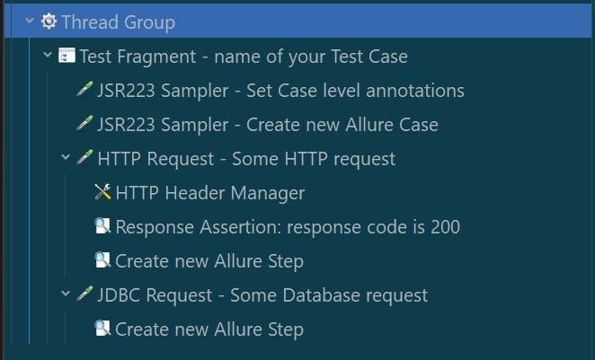
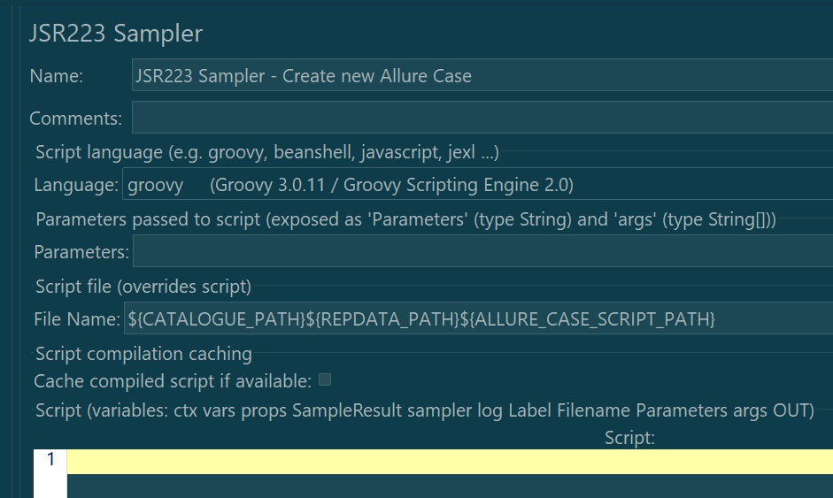
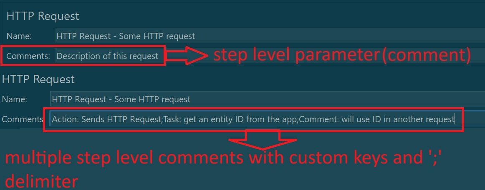
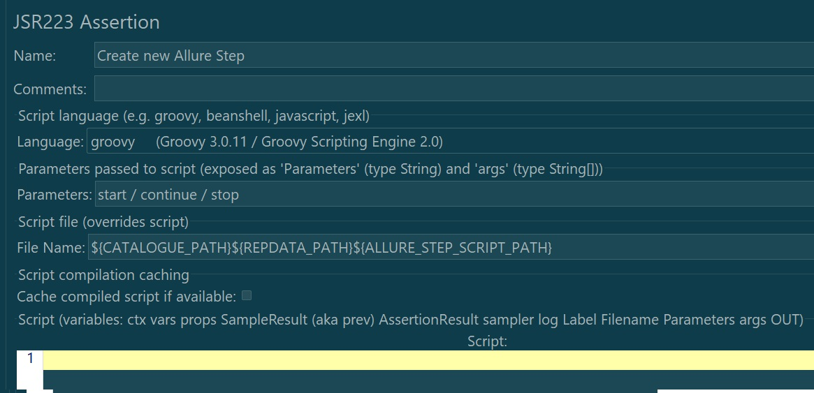

# JMeter integration for Allure Report

A Maven-based Java integration for Allure reporting with JMeter, providing an easy way to generate rich, interactive test reports.

---

## Table of Contents

- [Prerequisites](#prerequisites)  
- [Features](#features)  
- [Introduction](#introduction)  
- [Usage](#usage)  
  - [.JAR file](#jar-file)  
  - [User Defined Variables](#user-defined-variables)  
  - [Case Level Annotations](#case-level-annotations)  
  - [Add Scripts to Test Flow](#add-scripts-to-test-flow)  
  - [Configure Case and Step Samplers](#configure-case-and-step-samplers)  
  - [Report Generation](#report-generation)  
- [Additional Information](#additional-information)  
- [License](#license)  

---

## Prerequisites
 - [JMeter 5.0+](https://jmeter.apache.org/download_jmeter.cgi)
 - Java 8 (shipped with JMeter) or higher
 - [Allure CLI](https://github.com/allure-framework/allure2/releases)

---

## Features
 - Uber JAR: Single shaded JAR bundling all dependencies.
 - Doxygen Docs: Detailed documentation of code.
 - Examples: Groovy scripts demonstrating how to create Case, Step, and how to Generate Report.

---

## Introduction
There is no built-in reporting in JMeter for functional testing, and rolling your own logging—even in a custom format—quickly becomes too complex for less-technical team members. Enter Allure Reporting: a widely adopted, interactive HTML report framework. This integration brings Allure to your JMeter tests via a simple shaded JAR and a handful of Groovy scripts.

---

##  Usage
Via the example Groovy scripts, you can wire Allure into your JMeter Test Plan in just a few steps.

### 1) .JAR file
Put the `.jar` file in `path/to/jmeter/lib` **OR** add it to your Test Plan’s classpath manually.
> NOTE: `.jar` file can be found in Releases section of this repository.

### 2) User Defined Variables
In your Test Plan, define these JMeter User Defined Variables:

- `CATALOGUE_PATH`  
>  Path to your repositories directory (e.g. `C:/path/to/repositories/`).  
- `REPDATA_PATH`  
>  Path to the root JMeter directory inside the repository (e.g. `my/repository/jmeter/`).  
- `ALLURE_RESULTS_PATH`  
>  Where results (JSON/attachments) will be stored (absolute or relative to `/jmeter/bin`).  
- `ALLURE_BAT_PATH`  
>  Full path to the Allure CLI executable (e.g. `.../allure-2.34.0/bin/allure.bat`).  
- `ALLURE_CASE_SCRIPT_PATH`  
>  Path to the Groovy Case creation script (e.g. `./scripts/CreateCase.groovy`).  
- `ALLURE_STEP_SCRIPT_PATH`  
>  Path to the Groovy Step creation script (e.g. `./scripts/CreateStep.groovy`). 

### 3) Case Level Annotations
Create a JSR223 Sampler to populate Allure case metadata into `vars`:
``` groovy
vars.put("allure.name",          "The name of the current Case");
vars.put("allure.description",   "Description of the current Case. What it does? What it consis of? What goal does achieve?");
// Case parameters can be used for specific variable, a condition, or additional information
vars.put("allure.parameters",    "Condition: clean database;User name: John Doe;Role: common user");
vars.put("allure.label.epic",    "Main feature name of the release");
vars.put("allure.label.issue",   "XXX-1234");
vars.put("allure.label.feature", "Some cool feature");
vars.put("allure.label.story",   "Positive");
vars.put("allure.label.tag",     "Regress, Backend , UI ,Database");
vars.put("allure.label.owner",   "Your name or nickname");
vars.put("allure.links",         "Task tracker link 1,https://sd.example.com/browse/XXX-1234,Task tracker link 2,https://sd.example.com/browse/XXX-5678");
```

#### 4) Add scripts to test flow
Under `examples/`, you’ll find three scripts illustrating common workflows:
- **CreateCase.groovy**: How to start a new Allure test case within JMeter
- **CreateStep.groovy**: Add steps and attachments to the case.
- **GenerateReport.groovy**: Post-test report generation.

##### Example Test Plan flow:
- Test Fragment
  - **JSR223 Sampler**: Set Case level annotations
  - **JSR223 Sampler**: run CreateCase.groovy
  - **HTTP, JDBC, etc. Request**
    - **JSR223 Sampler**: run CreateStep.groovy
  - …repeat steps as needed… 
 - TearDown: run GenerateReport.groovy

> NOTE: any sampler that can execute Groovy/Java will work, not just JSR223!



#### 5) Configure Case and Step Samplers
Case creation script doesn't require any additional configuration and has no specifics.
Just point to the .groovy file and it's ready to go.



Step creation script takes:
- step-level comment
> Allure Report doesn't have any direct field in the Step object which could be used to add comments.
> But, we can improvise and use step level parameters for this.
> Value from the sampler’s “Comments” field to populate Step parameters
> NOTE: if parameter name (key) is not provided, the `Action` will be used as default



- last step identification
> To indentify that the current step is the last step for the Case we use parameters:
> "start" and "continue" Strings are **optional** and just serve visually appealing purpose
> "stop" String is **mandatory** and is used to trigger JSON and attachment creation



#### 6) Report generation
Place `GenerateReport.groovy` in your TearDown Thread Group. It consumes the JSON and attachments, invokes the Allure CLI to generate the report, and then cleans up the artifacts.

---

# Additional Information
For a deeper dive, consult the Doxygen docs on GitHub Pages and explore the Groovy scripts in examples/. A real-world use-case scenario is coming soon!

---

# License
This project is licensed under the Apache License 2.0. See LICENSE for details.
